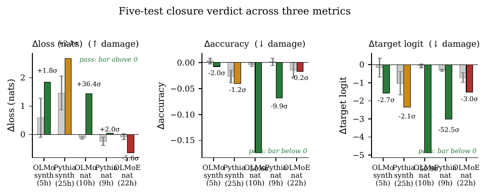
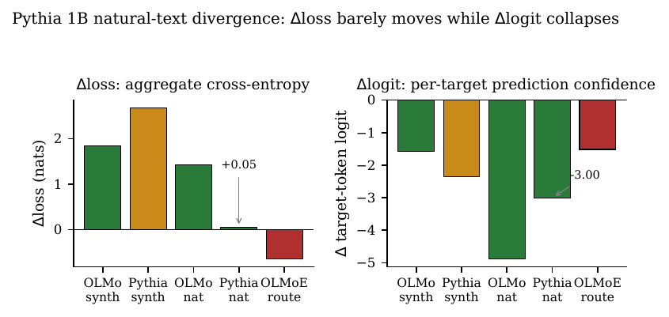
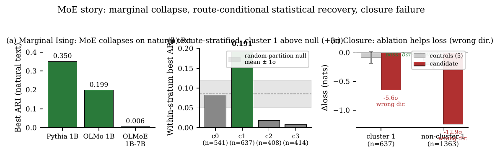

# Co-activation Communities Are Circuit Hypotheses, Not Circuits

**Closure tests in dense and MoE transformers, at 1B scale.**

Companion repository for the paper. We test whether unsupervised
clustering of attention-head co-activation statistics — adapting
Bhalla et al.'s (2026) SAE-feature Ising pipeline to attention heads —
identifies *circuits* (load-bearing subsystems whose ablation degrades
prediction) or merely *communities* (sets of heads that fire together
for reasons unrelated to function).

## Headline finding

| # | Model | Distribution | Cluster source | Heads | $z_{\Delta\ell}$ | $z_{\Delta\text{acc}}$ | $z_{\Delta z^{\text{tgt}}}$ | Verdict |
|---:|---|---|---|---:|---:|---:|---:|---|
| 1 | OLMo 1B | synthetic | Ising | 5 | +1.83σ | −1.97 | −2.68 | pass |
| 2 | Pythia 1B | synthetic | Ising, diffuse | 25 | +2.05σ | −1.16 | −2.06 | weak pass |
| 3 | **OLMo 1B** | **natural** | Ising | 10 | **+36.4σ** | **−50.6** | **−50.9** | **pass** |
| 4 | **Pythia 1B** | **natural** | Ising | 9 | +1.95σ | **−9.9** | **−52.5** | **pass (redundancy)** |
| 5 | **OLMoE 1B-7B** | natural | route-stratified Ising | 22 | **−5.64σ** | −0.22 | −2.97 | **fail (wrong dir.)** |

Each row: candidate community discovered unsupervisedly, ablated, and
compared against 5 matched-random-head controls on the same batch. The
candidate's z-score is signed: pass if $\Delta\ell > 0$ (loss
increases under ablation) and $\Delta\text{acc}, \Delta z^{\text{tgt}}
< 0$, with at least one metric well outside the random-control
distribution.

**Dense models pass closure across both synthetic and natural
distributions.** The MoE result fails on natural text *even after
route-conditional stratification that recovers the statistical signal
+3σ above a random-partition null*. The MoE failure is qualitative —
the candidate's removal *helps* loss, in the opposite direction from
what a real circuit on the discovery stratum should produce — and
cannot be rescued by metric choice.

## Four claims (from the paper)

1. **Co-activation clustering of attention-head focus statistics can
   propose communities that survive causal closure as load-bearing
   circuits in the two dense 1B-scale models tested.** 4 of 4 dense
   closure tests pass; OLMo 1B synthetic cluster 2 (5 heads, layer 0
   self-attention) saturates the ablate-all-of-layer-0 upper bound.
2. **Recovered communities are distribution-conditioned but not
   merely synthetic artifacts.** Natural-text dense communities pass
   closure with effect sizes on target-logit and accuracy comparable
   to or exceeding the synthetic cases.
3. **Route-conditional co-activation clustering in MoE recovers a
   statistical signal that fails closure.** On OLMoE natural text the
   marginal Ising collapses (ARI 0.006). Route-stratifying on
   per-layer routing weights recovers ARI 0.191 (+3.05σ above a
   random-partition null, 0/10 random seeds reached the observed
   value). The closure test on the recovered community fails in
   direction.
4. **Therefore unsupervised co-activation clustering is a circuit
   *proposal* method, not a circuit *discovery* method.** Closure
   testing remains necessary, and for MoE architectures on natural
   text, even route-conditional statistical recovery against a
   careful null is insufficient evidence of load-bearing.

## A methodological observation worth flagging

Across the five tests, the three closure-effect metrics (cross-entropy
loss, top-1 accuracy, mean target-token logit) rank results differently
and each has a known failure mode. Most notably, the **Pythia 1B
natural-text test shows a 25× divergence within the same test on the
same ablation**: $z_{\Delta\ell} = +1.95\sigma$ (borderline) but
$z_{\Delta z^{\text{tgt}}} = -52.5\sigma$ (the largest single z-score
in the study). We read this as a *downstream-redundancy signature* —
the candidate is load-bearing for the specific computation (the
target-token logit collapses by 3.0 units) but the model has
redundant downstream pathways that keep cross-entropy roughly
calibrated.

We recommend **multi-metric closure reporting**: direction first,
then target-logit and accuracy as primary indicators, then loss as a
conservative floor. See the paper's discussion for the full
protocol.

## Figures


*Figure 1. Multi-metric verdict across the five closure tests. Pass
tests have the candidate bar in the damage direction (above 0 on
$\Delta$loss; below 0 on $\Delta$accuracy and $\Delta$target-logit).
The MoE result flips direction on $\Delta$loss and $\Delta$target-logit.*


*Figure 2. Pythia 1B natural-text redundancy signature. The candidate
ablation produces a near-zero $\Delta$loss but a large negative
$\Delta$target-logit — about $18\times$ more downstream reconstruction
in Pythia than in OLMo on the natural batch.*


*Figure 3. The MoE story arc. (a) Marginal Ising collapses on OLMoE
natural text. (b) Route-stratification ($K=4$) recovers a within-stratum
signal in cluster 1, above the random-partition null band. (c) Closure
on the recovered cluster-1 community fails in direction: ablating helps
loss on both subsets, more so outside the discovery stratum than
inside.*

## Method (one paragraph)

For each model and batch, forward with `output_attentions=True` and
extract the attention pattern at a per-example query position. For
each head $(L, H)$, take the maximum attention weight to any key
position as a template-free *focus* signal, then binarize across the
batch at the head's own median. Fit a pairwise Ising model on the
$N \times F$ spin matrix by per-spin $L_2$-regularized logistic
regression (pseudolikelihood); symmetrize to get $J$. Spectral-cluster
$|J|$ for $k \in \{4, 6, 8, 10, 12\}$ and select the $k$ maximizing ARI
against the prior probe-circuit supervised classification. Pick the
candidate community by combined `purity × isolation × size-clip`.
Ablate the candidate via forward-pre-hook on the attention output
projection, compare per-example $\Delta\ell$, $\Delta\text{acc}$,
$\Delta z^{\text{tgt}}$ against 5 matched-random-head controls. For
MoE, additionally stratify examples by k-means clusters on per-layer
routing weights ($K=4$) and fit Ising within each stratum; verify
route-specificity with a random-partition null (10 random uniform
$K=4$ partitions of the same batch).

## Reproducing

```bash
pip install -r requirements.txt

# 1. Discovery pipeline (synthetic batch, ~5 min on MPS per model)
python pipeline/ising_circuit_discovery.py \
    --model EleutherAI/pythia-1b \
    --tag pythia_1b \
    --mechinterp-json <path-to-supervised-classification-json> \
    --out-dir results

# 2. Natural-text variant
python pipeline/ising_circuit_discovery_naturaltext.py \
    --model EleutherAI/pythia-1b ...

# 3. Route-conditional Ising for MoE
python pipeline/route_conditioned_ising_olmoe.py

# 4. Random-partition null (CPU only, ~1 min)
python pipeline/random_partition_null.py

# 5. Candidate selection
python closure/select_closure_candidate_pythia_natural.py

# 6. Closure test
python closure/closure_pythia_natural.py

# 7. Figures
python figures/generate_figures.py
```

Required: PyTorch with MPS or CUDA (forward passes on 1B-scale models),
HuggingFace `transformers`, sklearn, numpy, matplotlib.

## Repository layout

```
pipeline/        — discovery: Ising fits, route conditioning, null control
closure/         — candidate selection + closure tests per (model, distribution)
analysis/        — supplementary diagnostics (per-class recall, viz)
figures/         — figure generation script + 3 PDFs
results/         — JSON outputs from all closure tests + small .npy artifacts
                   (large attention tensors regenerated by re-running pipeline)
```

The large per-test attention tensors (`attn_at_query.npy`, 250–500MB
each) are not tracked — they can be regenerated by running the
pipeline scripts. The small artifacts that *are* tracked include:
discovered Ising coupling matrices `J.npy` (≤512KB each), routing
weights `routes_at_query.npy` (~8MB for OLMoE), and all JSON outputs
(closure results, candidate metadata, null distributions, supervised
classification metrics).

## Limitations

We tested two dense models (OLMo 1B, Pythia 1B) and one MoE
(OLMoE-1B-7B) on two input distributions (synthetic induction and
Pile-derived natural text). The asymmetry between dense and MoE
closure outcomes is unambiguous within this sample but cross-MoE
replication (Mixtral, DeepSeek-MoE) is needed before treating the
finding as general. Per-head ablation is destructive; alternative
interventions (mean-ablation, activation patching, counterfactual
ablation) may give different effect sizes. The cluster-discovery step
uses pairwise Ising; mutual information on binary spins gives
$\approx 2\times$ stronger ARI against the supervised classification in
the two dense models, but the closure results depend on the clusters
themselves, not on the affinity used to find them.

## Status

Working draft of the paper is kept local. This repo contains the
reproducible code, results JSONs, and figures referenced by the paper.

## License

MIT (see `LICENSE`).
